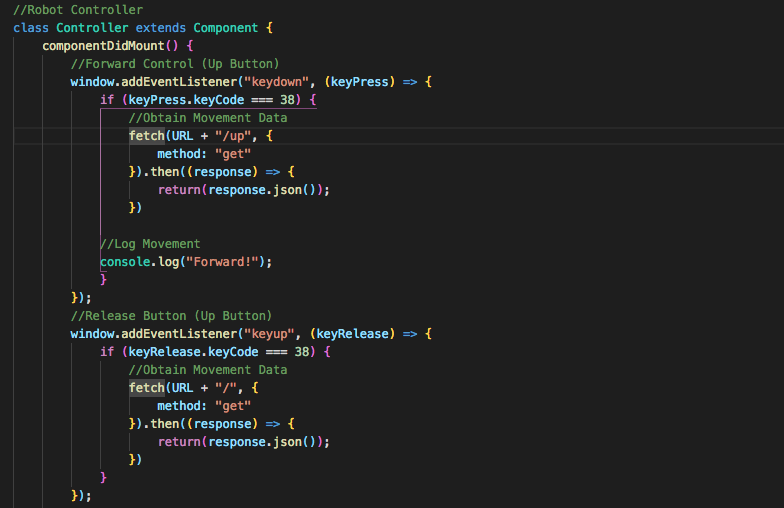

# SmartCar-R

SmartCar-R is an Arduino-powered robot car that is manipulated by a Raspberry Pi 3. The car is manually controlled by an end-user 
via a React user interface that gives the end-user the ability to manipulate the robot's movement via keyboard inputs. The interface 
also displays the attached Raspberry Pi Camera's footage from a first-person perspective.

This robot was created as my final DigitalCrafts project! The project was presented at the "Demo Day" public event in the Atlanta 
Tech Village facility. The name of the overall project is based on the robot's concept and developer's name. (SmartCar-R | SmartCar-Ryan)

## Authors
* **Ryan Miller** - [Ryan's GitHub](https://github.com/Ryan330)

## Built With
* React
* JSX
* JavaScript
* Node.js
* Express.js
* Serial Port
* C++
* HTML
* CSS
* Visual Studio Code
* Arduino
* Raspberry Pi 3
* Raspbian
* Raspberry Pi Camera V2
* MJPEG
* Inland 5,200mAh Power Bank

## Development Process
### -Concept-
SmartCar-R is a wireless robot car that is manually controlled by an end-user via a computer keyboard. The robot's functionality is 
manipulated by an Arduino module which receives data from a Raspberry Pi 3. The concept of SmartCar-R is it gives the end-user 
complete control via a React application which displays a first-person view from the robot's Raspberry Pi Camera along with a control 
layout to give the end-user directions regarding how to manipulate the robot.

### -Web Design-
The SmartCar-R user interface is a React-based application that uses JavaScript, JSX, HTML, and CSS. The interface uses "fetch()" 
requests to establish a connection between the front-end and the backend to ultimately manipulate the robot.

### -Backend Development-
Because the robot is ultimately manipulated by the Arduino module, the overall goal of the backend is to send data to the Arduino 
module to produce a reaction with the robot. The Arduino module is coded in C++ to establish hardware functionality. The module then 
waits for data to be given to it by the Node.js server.

The Node.js server uses the Serial Port module to establish a wireless connection with the Raspberry Pi device. The data is then sent through Express.js "get()" requests to call the created C++ Arduino functions that were coded for hardware functionality.

The React user interface displays the live footage which is recorded by the attached Raspberry Pi Camera V2. The live stream begins with the "raspistill" Raspbian command. The footage is then displayed on the React user interface with an "<iframe>" HTML tag that references the Raspberry Pi's IP address and backend port number using the MJEPG process.

### -Project Challenges-
During the development process, the biggest challenge overall was coding and establishing the wireless connection between the backend 
Node.js server and the Raspberry Pi 3 device which would be used to send data to the Arduino module for robot functionality. This was my 
first Raspberry Pi and Arduino project which made it a bit of a tedious learning process. 

It was a rather great experience to quickly explore the possibilities of not only the hardware, but also the opportunities to work with new software and different languages with only 2 weeks until the set deadline.

## License
### Copyright 2018 Ryan Miller
